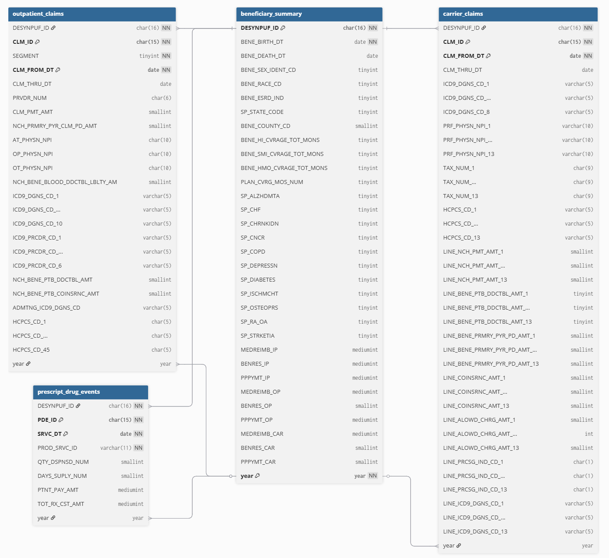
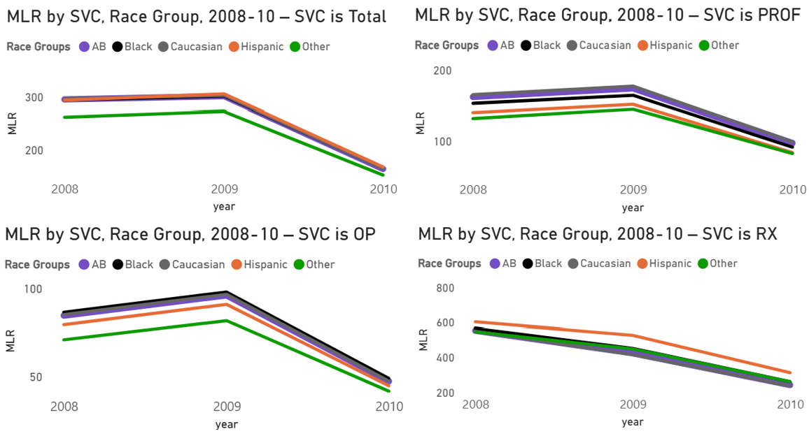

# Project Background
The CMS DE-SynPUF Medicare dataset was used to create an interactive dashboard that lets U.S. health plans benchmark year-over-year (YoY) trends in Cost PMPM, Count PMPM, and Medical Loss Ratio (MLR) across Medicare service lines (svc) and 5 race groups. The analysis is framed from the perspective of an in-house healthcare-analytics analyst to align insights with business questions.

A sentence of space was left in the project background for whatever POV this project wants to be framed in later. You are also missing a so what as to why you are analyzing these metrics and what this all means.

*How insights are evaluated in the report on the following key areas*:
- **MLR Trends by SVC:** The amount of money Medicare's spending yearly on healthcare compared to the amount Medicare's is charging beneficiaries in premiums to pay for it. SVCs analyzed: Outpatient (OP), Carrier (PROF), Prescription Drug Events (RX), and the combined Total. 
- **MLR Trends by Race Group & SVC:** MLR by race group (All Beneficiaries, Caucasian, Black, Hispanic, Other) analyzed within each svc to find deeper segment-level differences.
- **Cost PMPM Trends:** Medicare's average spending on care for each beneficiary every month, segmented by svc and race group.
- **Count PMPM Trends:** The number of claims on average each beneficiary uses per month in order to get care, segmented by svc and race group.

The SQL queries used to inspect and clean the data for this analysis can be found here [link].

Targeted SQL queries regarding various business questions can be found here [link].

An interactive PowerBI dashboard used to report and explore sales trends can be found here [link].

# Data Structure & Initial Checks

The database structure as seen below for the CMS DE-SynPUF Medicare dataset consists of 4 tables: beneficiary_summary, outpatient_claims, carrier_claims, and prescript_drug_events, with a total row count of [228.6 Million records](./assets/DE_SynPUF_table_records_distribution.png) being used acrossed all 4 tables. A description of each table is as follows:
- **beneficiary_summary:** Each row represents an individual beneficiary in the study. This table can connect to any of the healthcare claims tables below with a JOIN on the columns year and DESYNPUF_ID. This table covers: basic patient information, months of enrollment by Medicare plan pt., the patient's chronic conditions, and different yearly payments and reimbursement.
- **outpatient_claims:** Each row is a unique claim from a beneficiary in one of these areas: ER visits, same-day/ambulatory surgeries, hospital clinic visits, diagnostic testing, and rehab therapies. The rows in this table and the tables below are identified by a combo of a claim ID and a claim date. The table is under pt. B of Medicare. This table covers: physician and provider information, procedure codes, diagnosis codes, coinsurance and deductible payment amounts, and HCPCS cost codes.
- **carrier_claims:** Each row is a unique claim from a  beneficiary in one of these areas: doctor office visits & imaging, minor procedures, pathology tests, and physician-administered drugs. This table is also under pt. B of Medicare. This table covers: claim info, ICD claim & line diagnosis codes, physician info, provider tax numbers, HCPCS cost codes, different types of payment amounts.
- **prescript_drug_events:** Each row is a unique claim about a prescription drug order from a specific  beneficiary that was handled by the pharmacies. This table solely covers pt. D of Medicare. This table covers: the type of drug dispensed, the quantity, the day supply, the patient payment amount, and the gross drug cost.

ERD for CMS 2008-2010 DE-SynPUF

***Disclaimer:*** The outpatient_claims and carrier_claims tables had columns removed from the ERD diagram in order to fit in a singular screenshot because each table had 80+ columns. All removed columns were non-essential to the ERD.

# Executive Summary

### Overview of Findings

Add 1 more sentence related to the data analyst POV of the project, maybe tie in the so-what related to the data analyst POV that you still need to write. 

In the Total svc group Cost PMPM (+9.5%), Count PMPM (+6.3%), and MLR (+2.1%) rose modestly from 2008→2009; then from 2009→2010 they dropped sharply (−37.8%, −35.8%, −45.5%). These sharp declines a crossed all KPIs happenend due to 1 of 3 influences: positive influences (prevention, unit-price reductions, fewer complications, shift to home care), negative influences (higher patient cost sharing, tighter prior authorization, narrower networks, delayed claims), or a combination of both. The report further decomposes these KPIs by individual svc, race groups, and their component measures to identify what kinds of influences are driving these changes and evaluate how Medicare is performing. 

# Insights Deep Dive
### MLR by SVC:

- Total MLR (MLR where svc = Total) peaked at 301.0% in 2009—up +2.1% YoY from 2008—then fell -45.5% YoY in 2010 to 164.2%.

- The svc RX was the only svc with declines in MLR every year (-23.3% YoY 08->09 and -43.2% YoY 09->10). RX’s MLR fell from 552.2% (2008) to 240.7% in (2010). 

- The decline in RX's MLR is partly attributable to more beneficiaries with 12 months of Pt. D coverage: full-year enrollment rose from 53.2% (2008) to 74.7% (2010) in this sample.
  
- Just like the svc Total, OP’s and PROF’s MLR values peaked in 2009 at 95.9% and 173.6%, then fell in 2010 to 47.2% and 97.2%. In 2010, MLR declined across all service lines (YoY): Total −45.5%, OP −50.8%, PROF −44.0%, RX −43.2%.
  
- Allowed Cost is Medicare’s total annual spend on beneficiaries’ care and the numerator of MLR. Across OP, PROF, and RX, the relative distribution of Allowed Cost was stable, with a mean absolute YoY % change of 4.2%.

***Disclaimer:*** High Medical Loss Ratio (MLR) values in the 200–300% range in this report are not errors; they reflect that, unlike private insurers, Medicare is not funded solely by premiums.

### Category 2:

YoY MLR comparison across race groups within each service line to surface segment-level takeaways using %Δ YoY to compare values. 

* **Main insight 1.** More detail about the supporting analysis about this insight, including time frames, quantitative values, and observations about trends.
  
* **Main insight 2.** More detail about the supporting analysis about this insight, including time frames, quantitative values, and observations about trends.
  
* **Main insight 3.** More detail about the supporting analysis about this insight, including time frames, quantitative values, and observations about trends.
  
* **Main insight 4.** More detail about the supporting analysis about this insight, including time frames, quantitative values, and observations about trends.

### Category 3:

YoY change in Cost PMPM by service line, showing how total claim costs **per member-month** are changing as well the underlying percent distributions of this metric.

* **Main insight 1.** More detail about the supporting analysis about this insight, including time frames, quantitative values, and observations about trends.
  
* **Main insight 2.** More detail about the supporting analysis about this insight, including time frames, quantitative values, and observations about trends.
  
* **Main insight 3.** More detail about the supporting analysis about this insight, including time frames, quantitative values, and observations about trends.
  
* **Main insight 4.** More detail about the supporting analysis about this insight, including time frames, quantitative values, and observations about trends.

[Visualization specific to category 3]

### Category 4:

YoY change in Count PMPM by service line, showing how service/claim counts per member-month are changing as well as underlying percent distributions of this metric.

* **Main insight 1.** More detail about the supporting analysis about this insight, including time frames, quantitative values, and observations about trends.
  
* **Main insight 2.** More detail about the supporting analysis about this insight, including time frames, quantitative values, and observations about trends.
  
* **Main insight 3.** More detail about the supporting analysis about this insight, including time frames, quantitative values, and observations about trends.
  
* **Main insight 4.** More detail about the supporting analysis about this insight, including time frames, quantitative values, and observations about trends.

[Visualization specific to category 4]

# Recommendations:

Based on the insights and findings above, we would recommend the [stakeholder team] to consider the following: 

* Specific observation that is related to a recommended action. **Recommendation or general guidance based on this observation.**
  
* Specific observation that is related to a recommended action. **Recommendation or general guidance based on this observation.**
  
* Specific observation that is related to a recommended action. **Recommendation or general guidance based on this observation.**
  
* Specific observation that is related to a recommended action. **Recommendation or general guidance based on this observation.**
  
* Specific observation that is related to a recommended action. **Recommendation or general guidance based on this observation.**
  

# Assumptions and Caveats:

Throughout the analysis, multiple assumptions were made to manage challenges with the data. These assumptions and caveats are noted below:

* Assumption 1 (ex: missing country records were for customers based in the US, and were re-coded to be US citizens)
  
* Assumption 1 (ex: data for December 2021 was missing - this was imputed using a combination of historical trends and December 2020 data)
  
* Assumption 1 (ex: because 3% of the refund date column contained non-sensical dates, these were excluded from the analysis)
