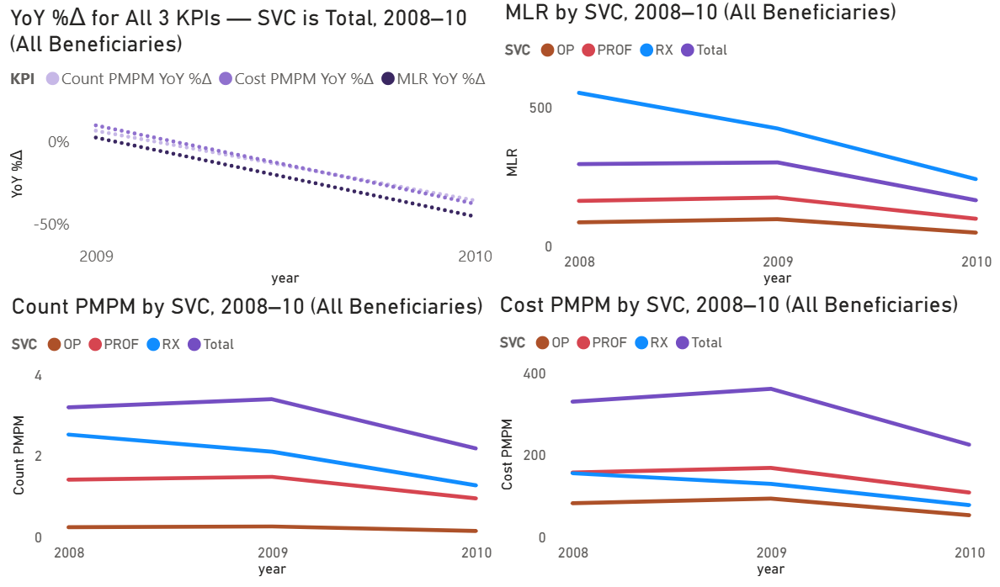
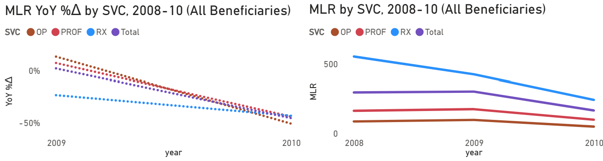

# Medicare DESynPUF Analysis (MLR, Cost PMPM, Count PMPM), 2008–2010

## Table of Contents
- [Project Background](#project-background)
- [Data Structure & Initial Checks](#data-structure--initial-checks)
- [Executive Summary](#executive-summary)
- [Insights Deep Dive](#insights-deep-dive)
  - [MLR by SVC](#mlr-by-svc)
  - [MLR by Race Group and SVC](#mlr-by-race-group-and-svc)
  - [Cost PMPM by Race Group and SVC](#cost-pmpm-by-race-group-and-svc)
  - [Count PMPM by Race Group and SVC](#count-pmpm-by-race-group-and-svc)
- [Recommendations](#recommendations)
  - [1) National Medicare Performance & Affordability](#1-national-medicare-performance--affordability)
  - [2) National Accessibility](#2-national-accessibility)
  - [3) National Equity](#3-national-equity)
- [Assumptions and Caveats](#assumptions-and-caveats)

# Project Background

The Pennsylvania Department of Aging, specifically the Secretary’s Office and the Office of Policy & Planning, engaged a third-party healthcare analytics consultant to develop a dashboard and report. The project assesses the performance, accessibility, and equity of Medicare Parts B and D and Total (all service lines) at the national level, with the intent to later compare these findings to Pennsylvania’s state-level performance. The analysis uses the [CMS DE-SynPUF Medicare 2008–2010 dataset](https://www.cms.gov/data-research/statistics-trends-and-reports/medicare-claims-synthetic-public-use-files/cms-2008-2010-data-entrepreneurs-synthetic-public-use-file-de-synpuf) to measure year-over-year (YoY) trends in **Cost PMPM**, **Count PMPM**, and **Medical Loss Ratio (**MLR**)** across Medicare service lines (svc) and 5 race groups. Given the parallel KPI declines by 2010, the analysis considers whether these trends reflect access barriers (cost sharing, prior authorization, network limits) or beneficial shifts (prevention, price reductions). The findings aim to guide decisions on outreach funding, transportation support, and benefits counseling.

*How insights are evaluated in the report on the following key areas*:

- **MLR Trends by SVC:** The amount Medicare spends yearly on healthcare compared to the amount Medicare charges beneficiaries in premiums to pay for it. SVCs analyzed: Outpatient (OP), Carrier (PROF), Prescription Drug Events (RX), and Total. 
- **MLR Trends by Race Group & SVC:** **MLR** by race group (All Beneficiaries, Caucasian, Black, Hispanic, Other) analyzed within each svc to find deeper segment-level differences.
- **Cost PMPM Trends by SVC & Race Group:** Medicare's average spending on care for each beneficiary every month for a specific year.
- **Count PMPM Trends by SVC & Race Group:** The number of claims on average each beneficiary uses per month in order to get care.

The SQL queries used to inspect and clean the data for this analysis are available here [link].

Targeted SQL queries regarding various business questions can be found here [link].

An interactive Power BI dashboard used to report and explore sales trends can be found here [link].

# Data Structure & Initial Checks
The database structure as seen below for the CMS DE-SynPUF Medicare dataset consists of 4 tables: beneficiary_summary, outpatient_claims, carrier_claims, and prescript_drug_events, with a total row count of [**228.6** Million records](./assets/DE_SynPUF_table_records_distribution.png) being used across all 4 tables. A description of each table is as follows:

- **beneficiary_summary:** Each row represents an individual beneficiary in the study. This table can connect to any of the healthcare claims tables below with a JOIN on the columns year and DESYNPUF_ID. This table covers: basic patient information, months of enrollment by Medicare plan pt., the patient's chronic conditions, and different yearly payments and reimbursements.
- **outpatient_claims:** Each row is a unique claim from a beneficiary in one of these areas: ER visits, same-day/ambulatory surgeries, hospital clinic visits, diagnostic testing, and rehab therapies. The rows in this table and the tables below are identified by a combo of a claim ID and a claim date. The table is under pt. B of Medicare. This table covers: physician and provider information, procedure codes, diagnosis codes, coinsurance and deductible payment amounts, and HCPCS cost codes.
- **carrier_claims:** Each row is a unique claim from a  beneficiary in one of these areas: doctor office visits & imaging, minor procedures, pathology tests, and physician-administered drugs. This table is also under pt. B of Medicare. This table covers: claim info, ICD claim & line diagnosis codes, physician info, provider tax numbers, HCPCS cost codes, different types of payment amounts.
- **prescript_drug_events:** Each row is a unique claim about a prescription drug order from a specific  beneficiary that was handled by the pharmacies. This table solely covers pt. D of Medicare. This table covers: the type of drug dispensed, the quantity, the day supply, the patient payment amount, and the gross drug cost.

ERD for CMS 2008-2010 DE-SynPUF

***Disclaimer:*** The outpatient_claims and carrier_claims tables had columns removed from the ERD diagram in order to fit in a singular screenshot because each table had 80+ columns. All removed columns were non-essential to the ERD.

# Executive Summary

### Overview of Findings
Across the three KPIs, Medicare’s performance for beneficiaries declined sharply by 2010. Under the Total group, KPIs rose from 2008→2009 (**MLR** **+2.1%**, **Cost PMPM** **+9.5%**, **Count PMPM** **+6.3%**) and then fell from 2009→2010 (**-45.5%**, **-37.8%**, **-35.8%**), ending at **MLR** **164.2%**, **$223.8** PMPM, and **2.2 claims PMPM**. Accessibility contracted broadly in 2010. **Count PMPM** fell across svcs: Total **-35.8%**, OP **-44.0%**, PROF **-36.1%**, and RX **-39.7%**. Equity trends based on Cost and **Count PMPM** by race group moved in parallel but for different svcs; for example, the Other group had [lower equity](./assets/lower_equity_rg_graphs.png) in Total/OP/PROF, while Hispanic had [greater equity](./assets/greater_equity_rg_graphs.png) in Total/RX. The analysis decomposes results by service line, race group, and component measures to distinguish beneficial vs. restrictive drivers (prevention, price cuts vs. cost sharing, prior authorization, networks, delayed claims) and to guide targeted actions in outreach, transportation, and benefits counseling.

# Insights Deep Dive

### **MLR** by SVC:
- Total **MLR** (**MLR** where svc = Total) peaked at **301.0%** in 2009, up **+2.1%** YoY from 2008, then fell **-45.5%** YoY in 2010 to **164.2%**.

- The svc RX was the only svc with declines in **MLR** every year (**-23.3%** YoY 08->09 and **-43.2%** YoY 09->10). RX’s **MLR** fell from **552.2%** (2008) to **240.7%** in (2010). 

- The decline in RX's **MLR** is partly attributable to more beneficiaries with 12 months of Pt. D coverage: full-year enrollment rose from **53.2%** (2008) to **74.7%** (2010) according to the [Pt. D Member Months Coverage-Length Distribution Graph](./assets/part_d_distribution_graph.png).

- Just like the svc Total, OP’s and PROF’s **MLR** values peaked in 2009 at **95.9%** and **173.6%**, then fell in 2010 to **47.2%** and **97.2%**. In 2010, **MLR** declined across all service lines (YoY): Total **-45.5%**, OP **-50.8%**, PROF **-44.0%**, RX **-43.2%**.

- Allowed Cost is Medicare’s total annual spending on beneficiaries’ care and the numerator of **MLR**. Based on the [Allowed Cost Distribution Graph](./assets/allowed_cost_distribution_graph.png) for OP, PROF, and RX, the relative distribution of Allowed Cost was stable, with a mean absolute YoY %Δ of **4.2%**.

***Disclaimer:*** High **Medical Loss Ratio (**MLR**)** values in the **200–300%** range in this report are not errors; they reflect that, unlike private insurers, Medicare is not funded solely by premiums. MLRs below **85%** aren’t errors, Part B premiums can fully cover some service lines (e.g. OP), but this service-line view excludes the combined OP + PROF cost.

### **MLR** by Race Group and SVC:

- Total **MLR** by race group: All Beneficiaries (AB), Black, Caucasian, and Hispanic are tightly clustered, peaking in 2009 at **301.0–305.2%**. The Other group peaks lower at **272.7%** (vs. AB **301%**) in 2009. In 2010 all groups declined by a similar margin (YoY **-44.1%** to **-45.6%**).

- OP **MLR** by race group: AB, Black, Caucasian, and Hispanic are tightly clustered, peaking in 2009 at **90.8–97.8%**; Other peaks lower at **81.5%** (vs. AB **95.9%**). In 2010, all groups declined by a similar amount (YoY **-49.0%** to **-50.9%**). 

- PROF **MLR** by race group: The five groups are fairly evenly spaced, with inter-group ranges of **~15–32** points year over year. **MLR** peaked in 2009 at **144.5–176.9%** (Other **144.5%** vs. AB **173.6%**). In 2010 all groups declined similarly (YoY **-42.9%** to **-44.6%**).

- RX **MLR** by race group: The Hispanic group’s **MLR** is consistently higher than the other four, with the widest gap in 2009 (**526%** vs. Black **451%**, **+75 pts**). RX MLRs peak in 2008 (**545.6–600.2%**). Again, in 2010 all groups declined similarly (YoY **-40.8%** to **-43.4%**).

**Tip:** To see the referenced values, hover over the graphs while in the dashboard. The tooltip on these graphs shows both the actual values and the YoY %Δ, while other graphs show only the actual values.

### **Cost PMPM** by Race Group and SVC:

- **Cost PMPM** uses Allowed Cost as its numerator, the same claims-dollar numerator as **MLR**, divided by member-months. Because the numerator trends are shared, **Cost PMPM** largely mirrors the **MLR** pattern: PROF, OP, and Total peak in 2009 at **$167.4**, **$92.4**, and **$359.8 PMPM**, then drop sharply in 2010, while RX peaks earlier at **$154.2 PMPM** in 2008 and declines thereafter. In 2010, **Cost PMPM** fell YoY across all service lines: Total **-37.8%**, OP **-43.6%**, PROF **-35.8%**, RX **-40.2%**.

- Despite the sharp decline in Total **Cost PMPM** by 2010, the denominator (member-months) was not the driver. As seen in the [Greatest Member Months Coverage-Length Distribution Graph](./assets/greatest_months_distribution_graph.png), full-year enrollment remained stable or increased: **87.3%** of beneficiaries had 12 months of Part B or Part D coverage in 2008, increasing to **92.1%** in 2010.

- Segmenting by race highlighting the lower equity pattern. [Total **Cost PMPM**](./assets/total_cost_pmpm_rg_graph.png) for AB, Black, Caucasian, and Hispanic is tightly clustered, peaking in 2009 at **$358.9–371.5 PMPM**. The Other group peaks lower at **326.1** PMPM (vs. AB **$359.8**) in 2009. In 2010, all groups decline by a similar amount (YoY **-36.5%** to **-38%**).

- Segmenting by race highlighting the higher equity pattern. [RX **Cost PMPM**](./assets/rx_cost_pmpm_graph.png) for AB, Black, Caucasian, and Other is tightly clustered, peaking in 2009 at **$126.2-136.9 PMPM**. The Hispanic group peaks lower at **$159.7** PMPM (vs. AB’s **$128.6**) in 2009. In 2010, all groups decline by a similar amount (YoY **-37.8%** to **-40.4%**).

### **Count PMPM** by Race Group and SVC:

- **Count PMPM** uses the same denominator as **Cost PMPM**, member-months, but a different numerator (claim counts, not dollars). Even so, it mirrors the **MLR**/**Cost PMPM** pattern: PROF, OP, and Total peak in 2009 at **1.5**, **0.3**, and **3.4 claims PMPM**, then drop sharply in 2010, while RX peaks earlier at **2.5** in 2008 and declines thereafter. In 2010, **Count PMPM** falls YoY across all service lines: Total **-35.8%**, OP **-44.0%**, PROF **-36.1%**, RX **-39.7%**.

- Claim Count is the annual total number of claims and serves as the numerator of **Count PMPM**. Based on the [Claim Count Distribution Graph](./assets/claim_count_distribution_graph.png) Across OP, PROF, and RX, its service-line share was stable, with a mean absolute YoY %Δ  of **3.5%**.

- PROF **Count PMPM** (Count where svc = PROF) peaked at **1.5 claims PMPM** in 2009, up **+5%** YoY from 2008, then fell **-36.1%** YoY in 2010 to **0.9** claims PMPM.

- The decline in PROF **Count PMPM** is not explained by coverage duration: full-year Part B enrollment rose from **84.0%** (2008) to **89.1%** (2010) according to the [Pt. B Member Months Coverage-Length Distribution graph](./assets/part_b_distribution_graph.png). This points to lower utilization per member, not a shrinking denominator.

- [Total **Count PMPM**](./assets/total_claim_pmpm_rg_graph.png) by race group mirrors the other KPIs: AB, Black, Caucasian, and Other are tightly clustered, peaking in 2009 at **3.3–3.4 claims PMPM**, while Hispanic peaks higher at **3.8** (vs. AB **3.4**). In 2010, all groups decline by a similar amount (YoY **-34.8%** to **-35.9%**).

# Recommendations:

Based on the insights and findings above, we recommend the Pennsylvania Department of Aging, specifically the Secretary’s Office and the Office of Policy & Planning, consider the following:

### 1) National Medicare Performance & Affordability
* **Break down **Cost PMPM** into its two parts**: utilization (claims per member) and unit price (average cost per claim) for each svc; where prices are the main driver, expand site of care shifts and strengthen contracting, and where utilization falls, restore high-value ambulatory visits. This recommendation is supported by the sharp declines from 2009 to 2010 in **Cost PMPM**, **Count PMPM**, and **MLR** (**-37.8%**, **-35.8%**, **-45.5%**), ending at **MLR** **164.2%**, **$223.8** PMPM, and **2.2 claims PMPM**. Treating **Cost PMPM** as Count multiplied by Unit Price pinpoints the controllable factor to act on, either the prices paid or the amount of care used, so actions match the true cause.
* **Build a scenario playbook**: create simple forward-looking projections for each KPI with three cases (best, base, worst), spell out the assumptions behind each case (utilization and unit price), define trigger thresholds, and pre-agree the actions to take if a trigger is hit. This is warranted because KPIs rose modestly from 2008 to 2009, then fell sharply from 2009 to 2010, indicating real volatility that leaders should plan for. Use **scenario bands** as easy-to-read ranges around each KPI (for example, green, yellow, red); when actual results move into a band, execute the matching actions such as tightening contracting, expanding outreach, or adjusting budgets.
  
### 2) National Accessibility
* **Pilot transportation and telehealth access fixes** in segments with the steepest utilization pullback, setting clear targets for recovering preventive and ambulatory visits. This is warranted because **Count PMPM** fell across every service line in 2010 (**Total** -35.8%****, **OP** -44.0%**, **PROF** -36.1%**, **RX** **-39.7%**) while **full-year Part B enrollment** rose about **5%** from 2008 to 2010, indicating reduced use rather than fewer covered months. Improving mobility and virtual access directly addresses likely access barriers and should help restore appropriate utilization.
* **Audit nonclinical frictions**: review prior authorization, referral loops, and appointment availability, and streamline pathways with navigator support and simpler workflows. This is justified because full-year enrollment increased from 2008 to 2010 (Part B from **84.0%** to **89.1%**, Part D from **53.2%**** to **74.7%**, and Greatest Months from **87.3%**** to **92.1%**), indicating that coverage duration expanded rather than shrank. When coverage rises while use falls, administrative barriers are a likely contributor; simplifying approvals and navigation should help restore necessary care without increasing low-value utilization.
  
### 3) National Equity
* **Target outreach where gaps persist**: use communications in beneficiaries’ **preferred language** (translated materials) alongside medication therapy management and preventive touchpoints tailored to each community. This is supported by equity patterns in **Cost PMPM** and **Count PMPM** by race and svc: the **Other** group has **lower equity** across **Total, OP, and PROF**, while **Hispanic** has **higher equity** in **RX** and **Total** (for example, in 2009 **Total Cost PMPM** for all race groups besides Other clustered around **$358.9** to **$371.5** PMPM** vs. **Other** at **$326.1PMPM**, and **RX Cost PMPM** for all race groups besides Hispanic clustered around **$126.2** to **$136.9** vs. **Hispanic** at **$159.7**). Tailored outreach and MTM should narrow these level differences while preserving overall trend improvements.
* **Publish an equity scorecard**: track gaps in use and spending by race group and svc, and fund interventions where gaps fail to narrow across review cycles. This is needed because each KPI shows race group declines by service in 2010 that move in parallel, which can mask persistent level differences (**MLR**: **-44.1%** to **-45.6%**; **Cost PMPM**: **-37.8%** to **-40.4%**; **Count PMPM**: **-34.8%** to **-35.9%**). A recurring scorecard keeps attention on closing gaps rather than only tracking service-line totals.
  
# Assumptions and Caveats:
Throughout the analysis, multiple assumptions were made to manage challenges with the data. These assumptions and caveats are noted below:

**Caveats:** Beneficiary opt-outs and data manipulation in 2010 greatly affected KPI results.
* **Increased opt-outs:** A meaningful share of beneficiaries likely opted out in 2010 due to heightened privacy concerns among those with rare or high-cost conditions being identified through the dataset, reducing representation of heavier utilizers.
* **Disclosure recoding/suppression:** To protect confidentiality, some rare or high-cost procedures were removed or recoded to more common, lower-cost categories, shifting the all 3 final KPIs. 
* **Comorbidity distortion:** The recorded number of chronic-condition comorbidities was artificially increased across the board. As a result, the dataset overstates how many conditions each beneficiary actually had, and additional claims were deleted or recoded to lower costs and reduce identifiability.

**Assumptions:** The component measure Premium Revenue was estimated
* **Premium Revenue Estimation Breakdown:** Premium revenue is the denominator (component measure) of **MLR**. For each beneficiary, it equals the months of Part B or Part D enrollment during the year multiplied by that year’s national average monthly premium for that part, then summed across beneficiaries. This simplification of premium revenue was necessary because the dataset lacks beneficiary-specific monthly premium amounts by Medicare part. By contrast, Allowed Cost, the **MLR** numerator, required no simplification and reflects the claims spend as reported.

